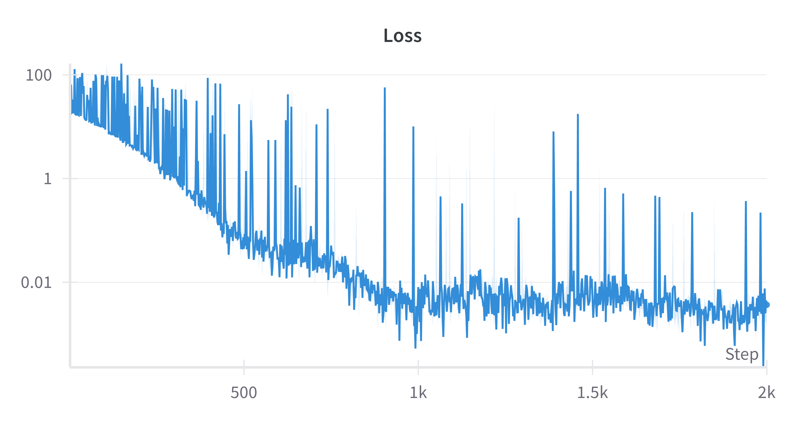
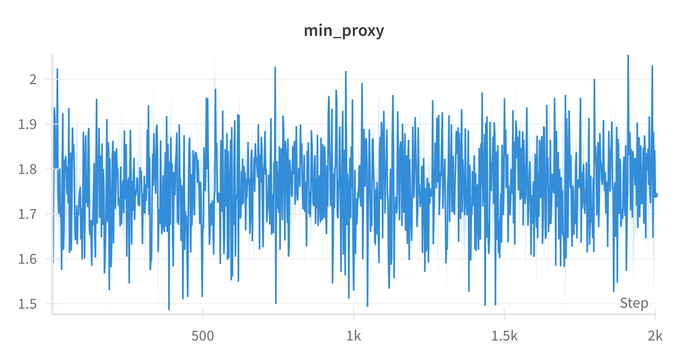
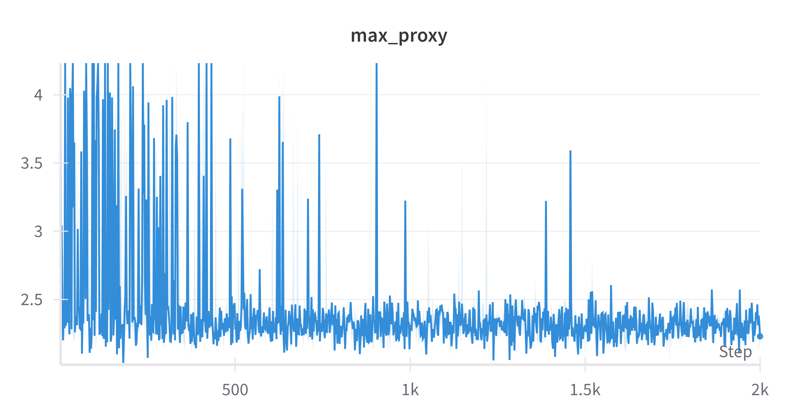
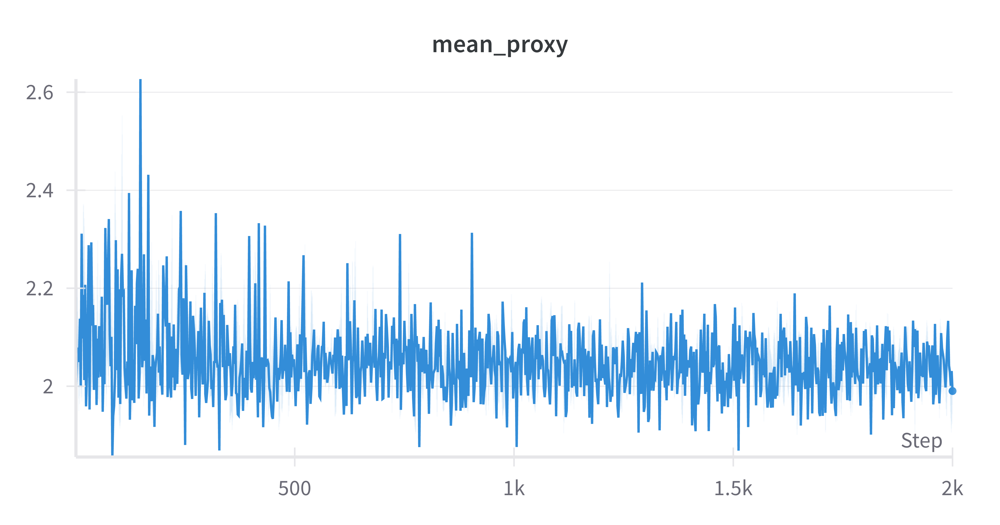

# GFlowNet for Catalyst Design: High Entropy Oxides (HEOs)

This repository contains an implementation of **GFlowNet** for tackling the catalyst design problem, with a focus on **sampling diverse High Entropy Oxides (HEOs)** that exhibit **low overpotential** values. The project includes:

- A **custom environment** that describes how HEO compositions are incrementally built.  
- A **proxy model** trained on real experimental data (~200 lab experiments) to simulate a lab’s response (overpotential).  
- A **GFlowNet** agent that samples new HEO compositions in proportion to their predicted reward.

---

## Table of Contents
1. [Motivation and Background](#motivation-and-background)  
2. [Approach Summary](#approach-summary)  
3. [Data and Simulated Lab](#data-and-simulated-lab)  
4. [HEO Environment](#heo-environment)  
5. [Modeling Pipeline](#modeling-pipeline)  
6. [GFlowNet Integration](#gflownet-integration)  
7. [Repository Structure](#repository-structure)  
8. [How to Run](#how-to-run)  
9. [Results](#results)  
10. [Future Directions](#future-directions)  
11. [Acknowledgments](#acknowledgments)

---

## 1. Motivation and Background

**High Entropy Oxides (HEOs)** are a class of materials formed by mixing multiple metal cations. They have shown promise in **electrocatalytic applications**, including the **Oxygen Evolution Reaction (OER)**—a key step in water splitting. Because the composition space is enormous, a **data-driven active learning** approach can help guide the discovery process efficiently.

---

## 2. Approach Summary

1. **Proxy Model (Simulated Lab)**  
   - I **trained a regression model** (a multilayer perceptron, MLP) on real experimental data (~200 lab experiments) to predict overpotentials.  
   - This MLP acts as a **stand-in** for a real lab: given any composition, it returns the predicted overpotential.

2. **GFlowNet Agent**  
   - The GFlowNet constructs HEO compositions step by step (incrementally deciding the fraction of each metal).  
   - At a final composition, the MLP is queried to produce a reward (commonly defined as the **inverse** of predicted overpotential).

3. **Active Learning Loop**  
   - The GFlowNet proposes a new composition based on its current policy.  
   - The proxy model supplies an overpotential, which is turned into a reward.  
   - The GFlowNet updates its policy to favor higher rewards (lower overpotentials).  
   - Repeat.

---

## 3. Data and Simulated Lab

This study relies on ~200 experimental measurements, each with:

- Compositions of various metals (e.g., Fe, Ni, Co, etc.).

- Measured overpotentials for OER.

These experimental data originate from:

Zhu et al., "Automated synthesis of oxygen-producing catalysts from Martian meteorites by a robotic AI chemist," Nature Synthesis, 2024. DOI: 10.1038/s44160-023-00424-1.

Since only discrete measurements were available, a proxy MLP was trained to interpolate or predict overpotential for novel compositions. This MLP is then used in the GFlowNet environment to assign rewards.

---

## 4. HEO Environment

To allow GFlowNet to **incrementally build** a valid HEO composition, I developed a custom environment (`HEO`) that:

- Maintains a **6-element vector**, each entry representing the fraction of one metal in the final composition.  
- Enforces that the total fraction sums to **1.0** (or 100%, depending on normalization).  
- Provides a **discrete action space** where each action adds a chosen fraction to the composition or triggers an “end-of-sequence” (EOS) event.  
- Prevents invalid moves by masking actions that exceed the remaining fraction “budget.”  

At every step:
1. The GFlowNet picks a fraction (or EOS token).  
2. The environment updates the current composition and reduces the remaining fraction budget.  
3. If all 6 fractions are chosen or the EOS token is selected, the environment is marked **done** and a final composition is submitted to the proxy model for a **predicted overpotential**.

---

## 5. Modeling Pipeline

1. **Data Analysis & Regression**  
   - Explored the ~200 data points, tested classical ML models (RF, Linear, SVM) plus an MLP.  
   - Chose an **MLP** for final deployment due to a decent balance of accuracy and simplicity.

2. **Proxy Model**  
   - The chosen MLP is loaded within the GFlowNet code.  
   - It receives the 6-element composition and returns a predicted **overpotential**.  
   - Reward = some function of \( \frac{1}{\text{overpotential}} \) (or \( \frac{1}{1 + \text{overpotential}} \)), chosen to focus on minimizing overpotential.

---

## 6. GFlowNet Integration

- The GFlowNet interacts with the HEO environment via:
  - **`step(action)`** to add a fraction or select EOS.  
  - **Masking** of invalid actions to ensure compositions remain valid and do not exceed a total fraction of 1.0.  
  - **States-to-proxy** transformations so the MLP can easily predict the overpotential.  

- Once a final state (composition) is reached, I log its predicted overpotential as the “reward” for that sample.

---

## 7. Repository Structure

```bash
.
├── data/
│   └── data.csv                # ~200 lab experiments (composition, overpotential)
├── regression_heo.ipynb        # Notebook: data analysis, regression models, MLP training
├── gflownet/
│   ├── envs/
│   │   └── heo.py              # GFlowNet environment for HEO design
│   ├── proxy/
│   │   └── heo.py              # Proxy model (MLP) for overpotential prediction
│   └── ...                     # Other GFlowNet framework files
├── main.py                     # Entry point for running the GFlowNet with the HEO environment
├── README.md                   # This README
└── requirements.txt            # Dependencies (PyTorch, scikit-learn, etc.)
```

---

## 8. How to Run

1. **Clone and Install**  
   - Run `git clone https://github.com/your-username/HEO-GFlowNet.git`  
   - Then `cd HEO-GFlowNet`  
   - Finally `pip install -r requirements.txt`

2. **(Optional) Train the Proxy Model**  
   - Open `regression_heo.ipynb`, run data exploration, train the MLP, and save the model weights.

3. **Run the GFlowNet**  
   - Execute `python main.py env=heo proxy=heo`  
   This will:
   - Initialize the `HEO` environment.  
   - Load the MLP (proxy model).  
   - Start sampling compositions, retrieving predicted overpotentials, and updating the GFlowNet policy.

4. **Monitor Logs**  
   - Check console outputs or your logging tool (e.g., Weights & Biases) for real-time training curves.  
   - Inspect final compositions and their predicted overpotentials.

---

## 9. Results

- **Training Curves**: Typical GFlowNet metrics (policy loss, trajectory coverage, etc.) plus min/mean/max overpotential.  
- **Compositions**: The GFlowNet converges toward compositions with **lower** predicted overpotential but still explores a diversity of solutions.










---

## 10. Future Directions

- **Adaptive Proxy**: Retrain or refine the MLP as more synthetic “data” is generated by the GFlowNet.  
- **Continuous Actions**: Investigate if a truly continuous approach (vs. discrete steps) can be integrated.  
- **Multi-Objective**: Incorporate additional objectives (e.g., cost, material stability).  
- **Uncertainty Quantification**: Use Bayesian neural networks or Gaussian Processes to guide exploration with predicted uncertainty.

---

## 11. Acknowledgments

- **Original GFlowNet Repository** by [Alex Hernandez-Garcia](https://github.com/alexhernandezgarcia/gflownet).  
- **Data** provided as part of a technical assignment (~200 lab experiments).  
- Thanks to the community behind **active learning** for materials discovery.  
- **Note**: no LLM was used for this solution, and it was created for the sake of practice.

---

*Last updated: 2025-02-09*
